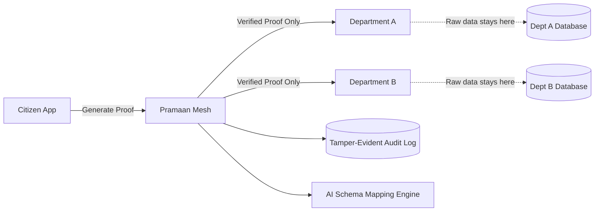

# 🛡️ Pramaan

### Proof travels. Your data doesn't.

**Pramaan** is an open-source zero-knowledge interoperability mesh for government services — letting departments verify facts about citizens without ever transferring their actual data. Started at Smart India Hackathon 2026, now building in the open.

[]()
[]()
[]()
[]()
[]()
[]()

---

> **We're actively looking for contributors.** Whether you know React, cryptography, UX design, technical writing, or just care about civic tech — there's a place for you here. Skip to [how to contribute](#-how-to-contribute) if you're ready to jump in.

## 📖 Table of Contents

- [Why This Project Exists](#-why-this-project-exists)
- [What We're Building](#-what-were-building)
- [Project Status](#-project-status)
- [How to Contribute](#-how-to-contribute)
- [Good First Issues](#-good-first-issues)
- [Tech Stack](#-tech-stack)
- [Local Setup](#-local-setup)
- [Architecture](#-architecture)
- [Areas We Need Help With](#-areas-we-need-help-with)
- [Community](#-community)
- [Code of Conduct](#-code-of-conduct)
- [Contributors](#-contributors)
- [License](#-license)

---

## 🧩 Why This Project Exists

Citizens across the world resubmit the same documents to different government offices because departmental systems can't talk to each other. Existing fixes assume departments must move citizen data around more efficiently to fix this — and that assumption is exactly why most interoperability projects stall: moving sensitive data is risky, legally complicated, and expensive to engineer around.

**Pramaan takes a different approach:** departments exchange cryptographic *proof* of a fact ("income below ₹2.5 lakh") instead of the underlying document. The civic-tech space needs more people working on this — which is why this is open source from day one, not a closed pitch deck project.

## 🚀 What We're Building

- 🔐 Zero-knowledge proof verification for eligibility checks
- 🆔 A single tracking number spanning multiple departments
- 🤝 AI-assisted schema mapping between mismatched legacy systems
- 🔌 Non-invasive legacy connectors (change-data-capture, no code changes to old systems)
- ✅ Citizen-controlled, revocable, time-bound consent
- ⛓️ Tamper-evident, independently verifiable audit logging

Full concept walkthrough in [`docs/CONCEPT.md`](./docs/CONCEPT.md).

## 📊 Project Status

This started as a Smart India Hackathon 2026 prototype and is now maturing into a genuinely reusable open-source project. **It is not production-ready and should not be deployed for real citizen data yet.** Current state:

| Component | Status |
|---|---|
| Citizen portal (wallet, proof generation, consent, tracking) | 🟢 Functional |
| Official dashboard + AI schema mapping | 🟢 Functional |
| Tamper-evident audit log | 🟢 Functional |
| Legacy CDC connector | 🟡 Simulated, real integration in progress |
| Aadhaar/DigiLocker identity integration | 🔴 Not started — needs government API access |
| Security audit | 🔴 Not started |

## 🙌 How to Contribute

We'd genuinely love your help. Here's the fastest path in:

1. ⭐ Star the repo if the idea resonates with you — it helps others discover it
2. Read [`CONTRIBUTING.md`](./CONTRIBUTING.md) for coding conventions and PR expectations
3. Check [open issues](../../issues) — look for the [`good first issue`](../../issues?q=label%3A%22good+first+issue%22) label if you're new here
4. Comment on the issue you want to work on before starting, so two people don't duplicate effort
5. Fork → branch → code → open a Pull Request against `main`

```bash
git checkout -b feature/short-description-of-your-change
git commit -m "Clear, specific commit message"
git push origin feature/short-description-of-your-change
```

No contribution is too small — typo fixes, better error messages, and documentation improvements are genuinely as valuable as new features for a project at this stage.

## 🟢 Good First Issues

New here? Start with issues labeled:
- [`good first issue`](../../issues?q=label%3A%22good+first+issue%22) — small, well-scoped, good for getting oriented
- [`help wanted`](../../issues?q=label%3A%22help+wanted%22) — broader tasks we'd love support on
- [`documentation`](../../issues?q=label%3A%22documentation%22) — no coding required

Don't see an issue that fits what you're interested in? Open a [Discussion](../../discussions) and propose one.

## 🛠️ Tech Stack

| Layer | Technology |
|---|---|
| Frontend | Next.js (React), TypeScript, Tailwind CSS, shadcn/ui |
| Backend | Node.js (NestJS) |
| Database | PostgreSQL + Prisma ORM |
| Auth | OAuth2/OIDC, Firebase Authentication |
| Crypto | zk-SNARKs (snarkjs + circom), SHA-256 hash chaining |
| AI | Gemini API (schema mapping) |
| Infra | Docker, GitHub Actions |

Not familiar with all of these? That's fine — most issues are scoped to one part of the stack, and the maintainers are happy to help you ramp up on whatever area you pick.

## 💻 Local Setup

```bash
git clone https://github.com/<your-username>/pramaan.git
cd pramaan
npm install
cp .env.example .env.local   # fill in required values, see CONTRIBUTING.md
npx prisma migrate dev
npm run dev
```

Runs at `http://localhost:3000`. If anything in setup doesn't work for you, please open an issue — that's a bug in our docs, not a mistake on your part.

## 🏗️ Architecture



Deeper dive in [`docs/ARCHITECTURE.md`](./docs/ARCHITECTURE.md).

## 🆘 Areas We Need Help With

- **Cryptography review** — if you know zk-SNARKs or verifiable credentials well, we'd love a second pair of eyes on our proof implementation
- **Accessibility** — WCAG 2.1 AA compliance pass across the citizen portal
- **i18n** — translating the UI into Hindi and other Indian languages
- **UX design** — the official/admin dashboards need design polish
- **Technical writing** — our docs are thin; clearer explanations of the proof flow would help a lot
- **DevOps** — CI/CD pipeline and containerization improvements

## 💬 Community

- [GitHub Discussions](../../discussions) — questions, proposals, and general chat
- [Issues](../../issues) — bug reports and feature requests
- _(Add a Discord/Slack link here once you set one up)_

## 📜 Code of Conduct

This project follows the [Contributor Covenant](./CODE_OF_CONDUCT.md). Be kind, be constructive, and assume good faith — especially with first-time contributors.

## 🌟 Contributors

Thanks to everyone who's contributed so far:

<!-- Add via https://github.com/all-contributors or similar once you have contributors -->
<a href="https://github.com/<your-username>/pramaan/graphs/contributors">
  /pramaan" />
</a>

## 📄 License

MIT — see [`LICENSE`](./LICENSE). Free to use, modify, and build on, including commercially, with attribution.

---

<p align="center">Built in the open. <b>Proof travels. Your data doesn't.</b></p>
